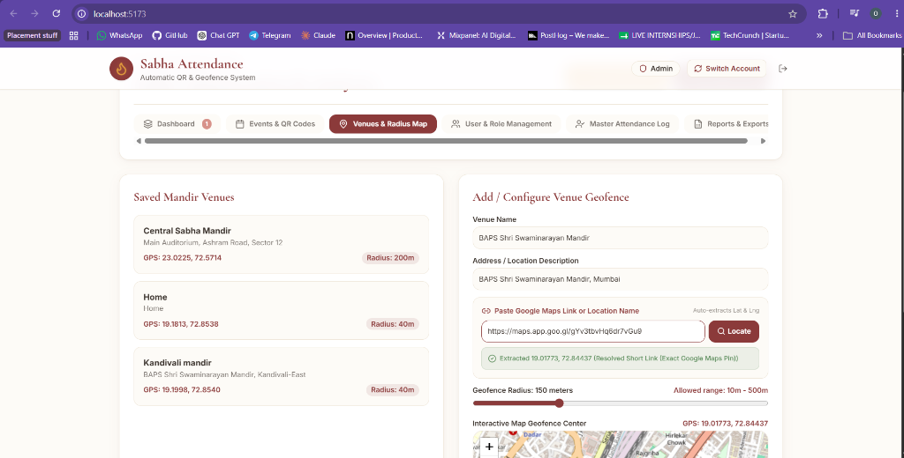
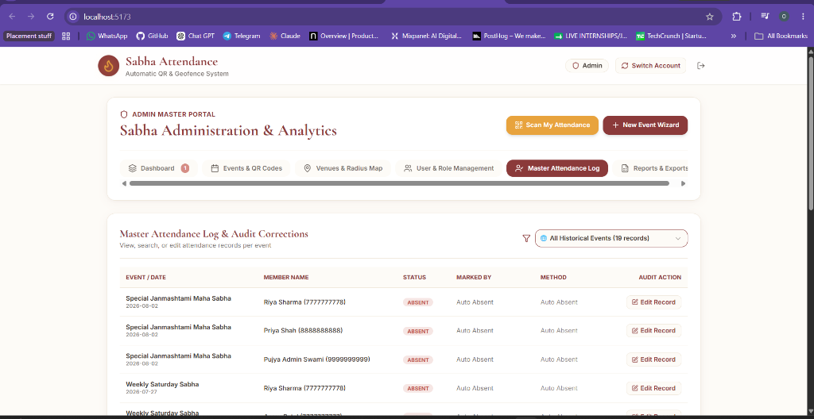
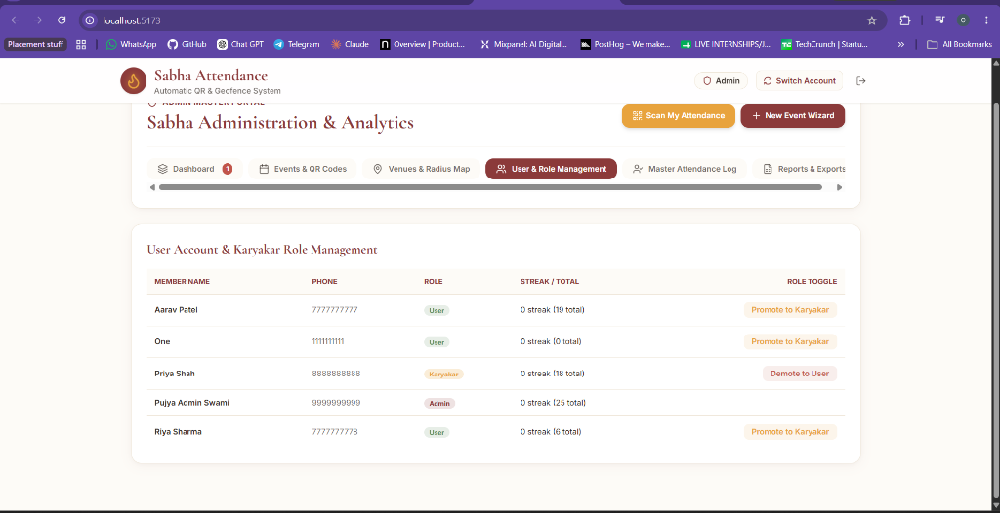
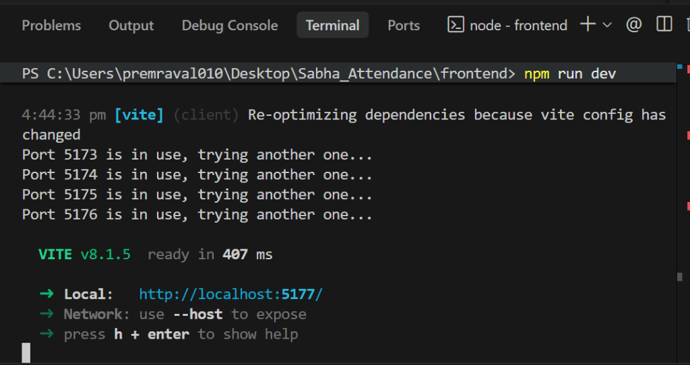
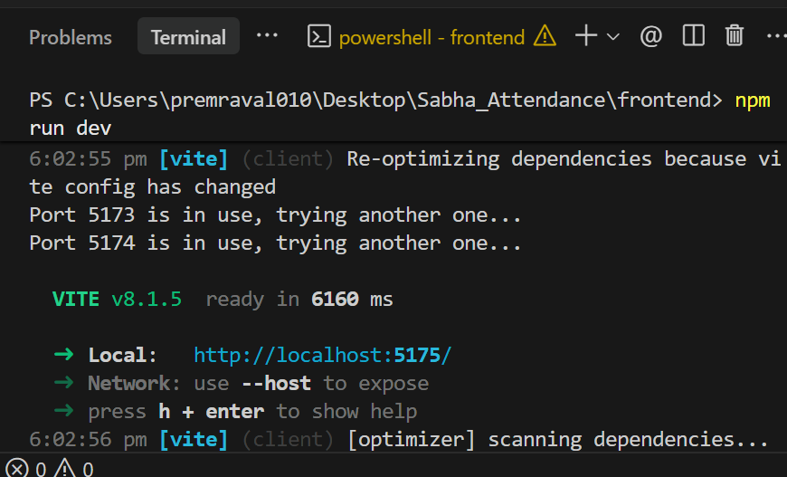
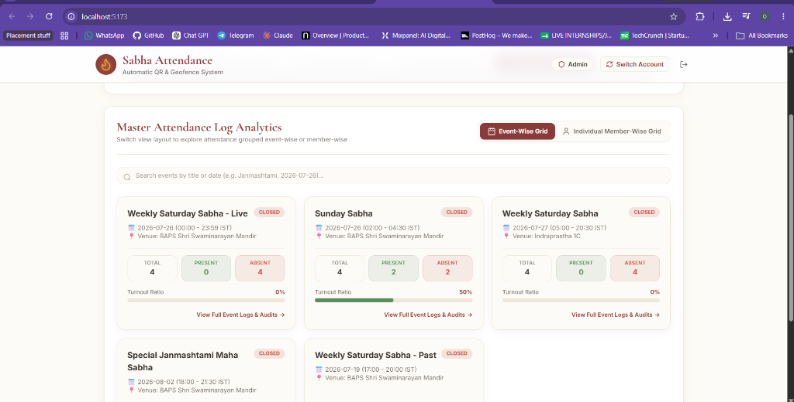
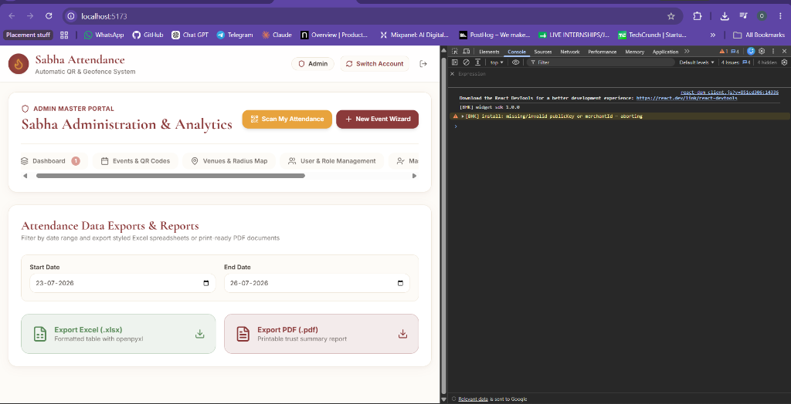
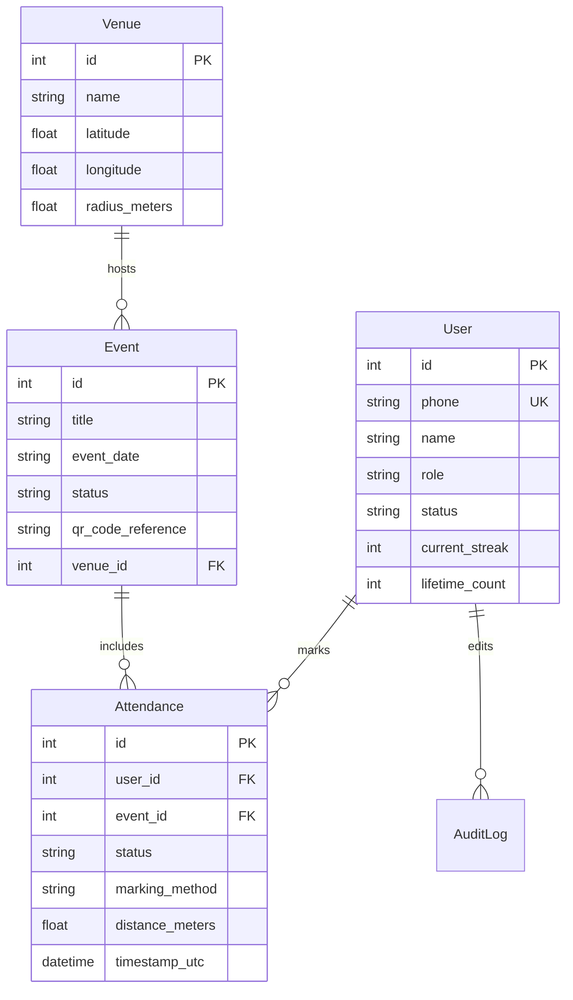

# 🛕 Sabha Attendance System — Automatic QR Code & GPS Geofence Verification

A state-of-the-art, full-stack web application designed for automated, secure, and verifiable attendance tracking for Weekly Sabha gatherings. Built with **React 18**, **Tailwind CSS**, **FastAPI**, **SQLAlchemy**, **Leaflet Maps**, and **ReportLab PDF Engine**.

---

## 🌟 Key System Features

### 1. 🛡️ Dual-Verification Attendance Engine
- **GPS Geofence Radius Verification**: Real-time browser GPS location lock verified against venue coordinates using the **Haversine formula**. Members can only mark attendance within the configured venue radius (10m - 500m).
- **Dynamic QR Code Scanning**: Supports both venue-reusable QR codes and per-event unique QR codes.
- **Multiple Scanner Options**: Supports live webcam scanning, QR photo upload (`.png`, `.jpg`), manual reference code entry, and simulated geofence testing.

### 2. 👑 Admin Master Portal & Analytics
- **Live Analytics Dashboard**: Real-time counter widgets for approved members, pending registrations, configured venues, and total scans.
- **Pending Registration Queue**: Approval/rejection interface for new member registrations.
- **User & Role Management**: Searchable member table with instant role toggle (`User` ↔ `Karyakar`).

### 3. 📅 Event Management & Creation Wizard
- **4-Step Creation Wizard**: Easily launch single or recurring Saturday/Sunday Sabhas.
- **Event Lifecycle Control**: Open attendance or close event to auto-generate `ABSENT` records for unrecorded members and calculate streaks.
- **Active & History Grids**: Clear separation between live open events and past completed events.

### 4. 📍 Interactive Venue & Geofence Map
- **Leaflet Interactive Map**: Drag map pins to place venue centers and adjust geofence radius dynamically from 10m to 500m.
- **Google Maps Link Parser**: Paste any Google Maps URL (or place name) to automatically extract precise latitude and longitude.

### 5. 📊 Dual Master Attendance Log Grids
- **Event-Wise Grid View**: Displays all events with total headcount, present/absent stats, turnout ratio progress bars, and modal audit details.
- **Individual Member-Wise Grid View**: Tracks member attendance totals, present/absent counts, current streak, and historical logs.

### 6. 📄 Event-Wise PDF & Excel Report Exports
- **Event-Grouped Reports**: Formatted Excel (`.xlsx`) and PDF (`.pdf`) documents.
- **Top Header Details**: Every event section displays:
  - **Event Title**: e.g., `Weekly Saturday Sabha`
  - **Date & Time**: `2026-07-26 (18:00 - 21:00 IST)`
  - **Location / Venue**: `BAPS Shri Swaminarayan Mandir`
  - **Turnout Metrics**: `Total Headcount: 10 | Present: 8 | Absent: 2 (80% Turnout)`
- **Direct Event Export Buttons**: Instant PDF and Excel export buttons on every completed event card and detail modal.

### 7. 🖨️ Printable QR Poster Builder
- **PNG Canvas Downloader**: Renders high-resolution 1:1 printable posters (`.png`).
- **Print / PDF Layout**: Exact 1:1 print-ready poster layout for physical display at Sabha venues.

### 8. 🪔 Member Portal & Diya Flame Streak Counter
- **Diya Flame Streak Widget**: Dynamic streak tracker calculation rewarding continuous Sabha attendance.
- **Top Status Banner**: Automatically replaces the scan button with an **`Attendance Verified: PRESENT`** success card once attendance is logged for the active event.
- **Pre-Mark Excused Absence**: Allows members to submit advance absence requests with mandatory reason logging.

---

## 📸 Application Screenshots & Output Showcase

### 1. Member Login Portal
Secure authentication with 10-digit mobile number validation and quick demo account buttons.


---

### 2. Member Dashboard & Diya Flame Streak Counter
Personalized dashboard displaying current streak, lifetime attendance, and active attendance status.


---

### 3. Live QR Scanner & Geofence Verification
Webcam scanner with real-time GPS location lock, image file scan, and simulated geofence verification.


---

### 4. Admin Master Portal Analytics
System analytics overview featuring pending user approval queue and quick access action buttons.


---

### 5. Event Master Schedule & Poster Builder
Management interface for active and completed events with instant poster creation.


---

### 6. Interactive Venue & Geofence Map
Leaflet map widget with radius slider and Google Maps URL location resolver.


---

### 7. Dual Master Attendance Log (Event & Member Grids)
Analytics view supporting Event-Wise and Member-Wise grid layouts.


---

### 8. Event Attendance Audit Modal
Detailed attendance log with status indicators, audit logs, and direct export options.


---

### 9. Attendance Data Exports & Reports
Report generator supporting event-specific or date-range Excel and PDF exports.


---

### 10. Event-Wise PDF Official Attendance Report Sample
Generated PDF document with Event Name, Location, Date, and Turnout Metrics at the top.


---

## 🛠️ Technology Stack

### Frontend
- **Framework**: React 18 (Vite)
- **Styling**: Vanilla CSS, Tailwind CSS tokens, Custom CSS variables
- **Icons**: Lucide React
- **Mapping & Geofencing**: Leaflet, React-Leaflet
- **QR Code Engine**: HTML5-QRCode

### Backend
- **Framework**: FastAPI (Python 3.13)
- **Database**: SQLite (Development) / PostgreSQL (Production) with SQLAlchemy ORM
- **Authentication**: PyJWT (JSON Web Tokens) with Bearer header & query param support
- **Report Generation**: OpenPyXL (Excel), ReportLab (PDF)

---

## 🗄️ Database Architecture



---

## 🚀 Quick Start & Installation

### Prerequisites
- **Node.js** (v18 or higher)
- **Python** (v3.10 or higher)

### 1. Clone & Setup Project
```bash
git clone https://github.com/omkarpraval/Sabha_Attendance.git
cd Sabha_Attendance
```

### 2. Install Backend Dependencies
```bash
cd backend
pip install -r requirements.txt
```

### 3. Install Frontend Dependencies
```bash
cd ../frontend
npm install
```

### 4. Run Application (Single Command)
Run both backend (FastAPI at `http://127.0.0.1:8000`) and frontend (Vite at `http://localhost:5173`) using the runner script:
```bash
cd ..
python run.py
```

---

## 🔑 Demo Login Accounts

Use these pre-configured accounts to test the application immediately:

| Role | Mobile Phone | Password | Access Level |
| :--- | :--- | :--- | :--- |
| **Admin** | `9999999999` | `admin123` | Full System Access, Event Creation, Venue Map, Audits & Reports |
| **Karyakar** | `8888888888` | `karyakar123` | Event View, Manual Attendance Marking, Export Reports |
| **User / Member** | `7777777777` | `user123` | Self Attendance Scan, Diya Streak Tracker, Excuse Submission |

---

## 📡 API Reference Summary

### Authentication
- `POST /api/auth/signup` — Member registration
- `POST /api/auth/login` — Phone & Password login (returns JWT token)
- `GET /api/auth/me` — Current authenticated user profile

### Events & Venues
- `GET /api/events` — Fetch all events
- `POST /api/events` — Create new event
- `POST /api/events/{id}/close` — Close event attendance (triggers auto-absent)
- `GET /api/venues` — Fetch saved venue geofences
- `POST /api/venues` — Create or update venue geofence

### Attendance & Reports
- `POST /api/attendance/scan` — Submit QR scan with GPS coordinates
- `GET /api/attendance/history` — User/Event attendance history
- `GET /api/reports/export/excel` — Download event-grouped Excel report (`.xlsx`)
- `GET /api/reports/export/pdf` — Download event-grouped PDF report (`.pdf`)

---

## 📄 License
Distributed under the MIT License. See `LICENSE` for more information.
