# 🛕 BAPS Sabha Attendance System — Automatic QR Code & GPS Geofence Verification

A full-stack web application designed for automated, secure, and verifiable attendance tracking for Weekly Sabha gatherings. Built with **React 18**, **Tailwind CSS**, **FastAPI**, **SQLAlchemy**, **Leaflet Maps**, **HTML5-QRCode**, **OpenPyXL**, and **ReportLab PDF Engine**.

---

## 🌟 Key System Architecture & Core Features

### 1. 🛡️ Dual-Verification Engine (GPS Geofence + Dynamic QR)
- **Haversine Distance Geofencing**: Real-time browser GPS location lock verified against venue coordinates. Attendance is validated only if the member is physically within the configured venue radius (10m - 500m).
- **Dynamic QR Code Modes**: Supports venue-reusable QR codes as well as per-event unique QR codes.
- **Multiple Scanning Modes**: Live webcam scanning, QR photo file upload (`.png`, `.jpg`), manual reference code entry, and simulated geofence testing.

### 2. 👑 Role-Based Access Control (RBAC)
- **User / Member Portal**: Personal dashboard with Diya Flame streak counter, lifetime attendance total, active event status, and advance excuse submission.
- **Karyakar Volunteer Portal**: Event selector, pending user registration queue, member directory, and manual attendance override controls (`Mark Present` / `Mark Absent`).
- **Admin Master Portal**: Full administrative control, system analytics counters, event creation wizard, venue geofence map builder, role management, and export generation.

---

## 📸 Comprehensive Frontend Output Showcase & Explanations

### 1. Authentication & Onboarding

#### Member Login Portal
- **Description**: Secure sign-in modal with 10-digit phone number validation, password visibility toggle, quick demo account selector buttons (Admin, Karyakar, User), and a Progressive Web App (PWA) installation tip banner.
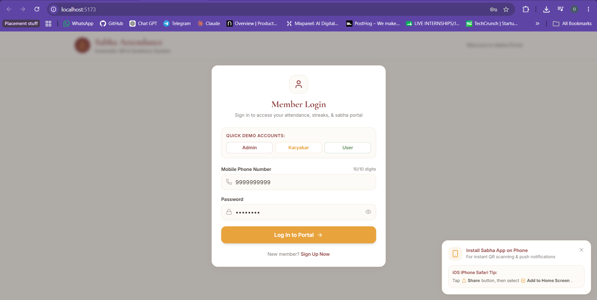

#### Member Registration Modal
- **Description**: Self-service signup modal allowing new members to register by providing their 10-digit mobile number, full name, date of birth (DOB), and password. Submitted accounts enter the Admin/Karyakar approval queue.
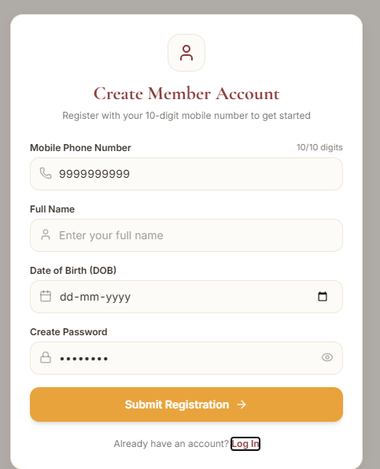

---

### 2. Member Portal & Attendance Scanning

#### Member Personal Dashboard & Streak Counter
- **Description**: Features a custom "Jai Swaminarayan" welcome header, a **Diya Flame Streak Counter** calculating consecutive sabha attendances, lifetime total attendance stats, the active event card, and personal calendar logs.
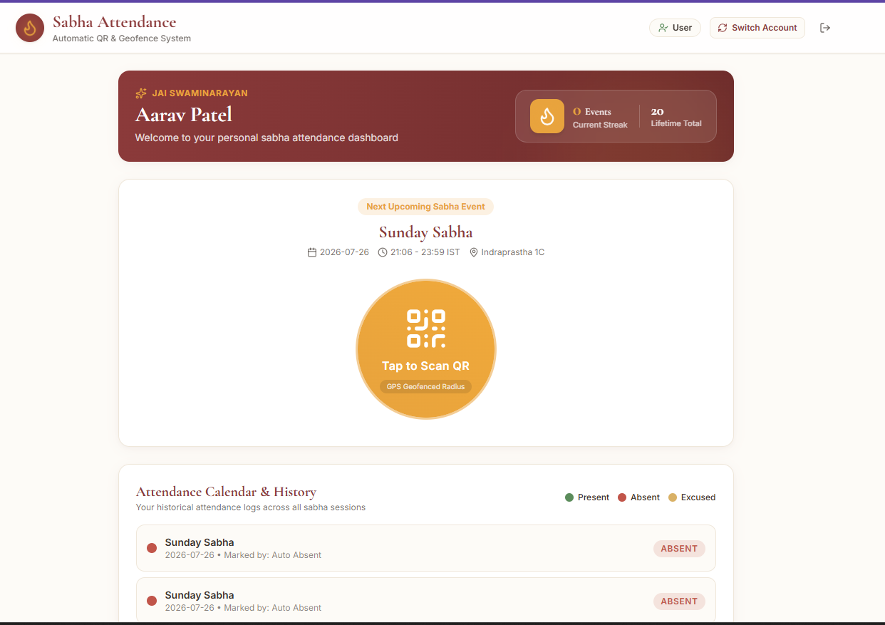

#### Live QR Scanner & Geofence Verification Modal
- **Description**: Interactive modal featuring live webcam video scanning with target viewport overlay, real-time GPS location locking (`19.1813, 72.8537`), image file upload scanner, manual reference code verification, and simulated geofence test buttons (`Scan AT Venue` vs `Scan FAR AWAY`).
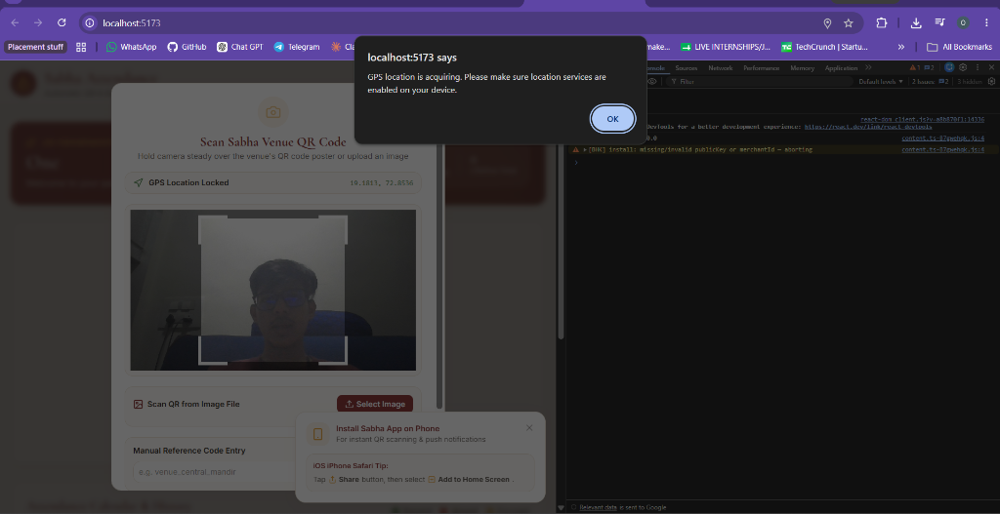

#### Personal Attendance Calendar & Pre-mark Excused Sessions
- **Description**: Historical attendance logs for the member with color-coded status badges (**PRESENT** in green, **ABSENT** in red), marking method details, and an **Upcoming Sabha Sessions** card with a **Pre-mark Excused** button for advance absence logging.
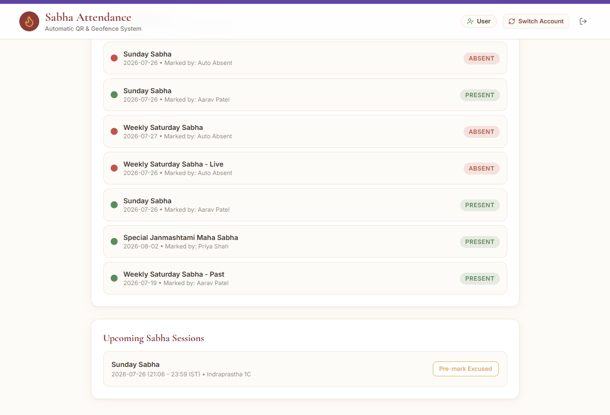

---

### 3. Karyakar Volunteer Attendance Control

#### Volunteer Control Portal & Manual Override Table
- **Description**: Dedicated dashboard for Karyakars featuring event selector dropdown, total present counter, pending signup notifications badge, member directory, and direct **Mark Present** / **Mark Absent** manual override buttons.
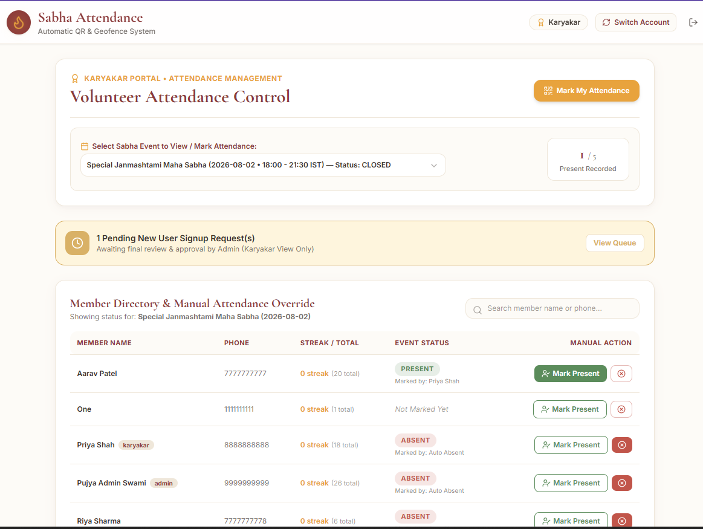

---

### 4. Admin Master Portal & Event Management

#### Admin Dashboard & System Analytics
- **Description**: Overview dashboard featuring key metric counters (Approved Members, Pending Approvals, Total Venues Configured, Total Scans Logged), Pending New User Approval Queue with instant **Approve** / **Reject** buttons, and active event status card.
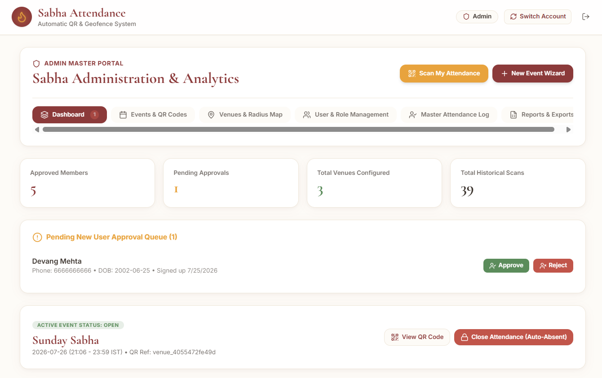

#### Active & Scheduled Events Master Schedule
- **Description**: Lists all open sabha events with details on venue radius, QR mode reference code, printable QR poster generator button, and **Close Sabha** action button.
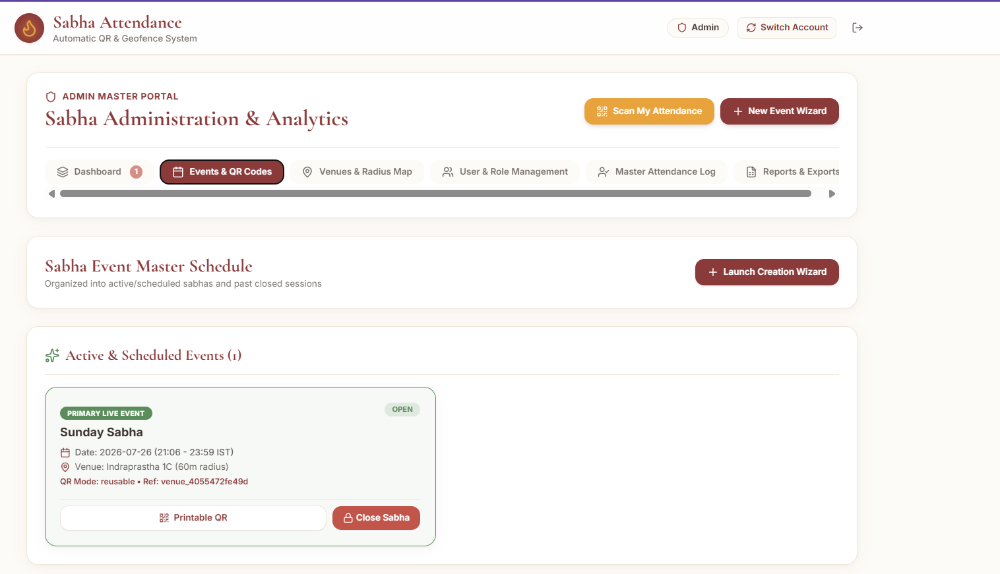

#### Past & Completed Events History Grid
- **Description**: Grid displaying all closed/completed sabha sessions. Every completed event card includes direct **Export PDF** and **Export Excel** buttons for immediate event-wise report downloads.
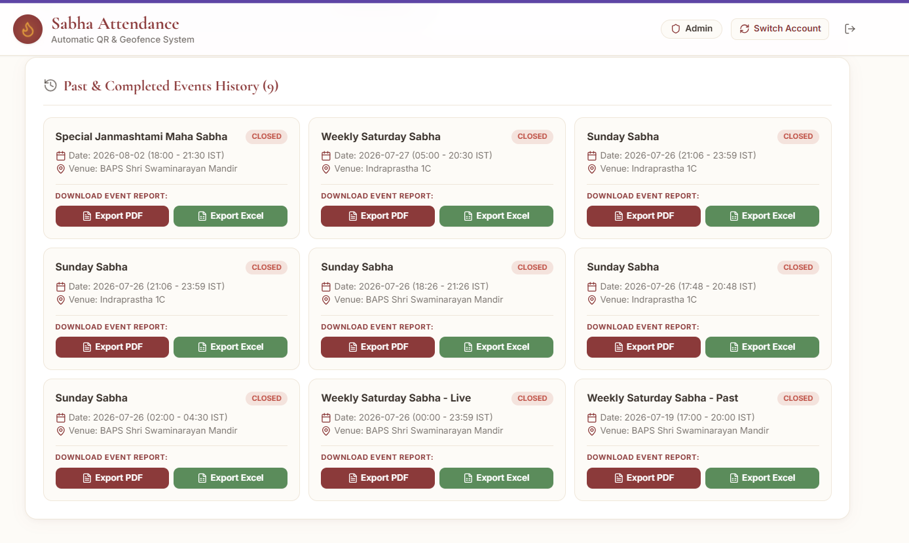

---

### 5. 4-Step Event Creation Wizard

| Step | Interface | Feature Description |
| :---: | :---: | :--- |
| **Step 1** | 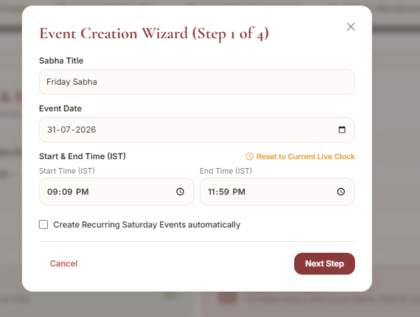 | **Basic Event Details**: Configure Sabha Title, Event Date, Start & End Time (IST), "Reset to Live Clock" helper, and automatic recurring Saturday sabhas toggle. |
| **Step 2** | 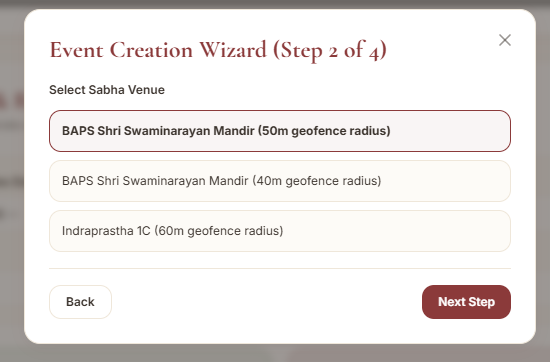 | **Venue Selection**: Choose from saved Mandir venue geofences with configured radii (e.g., 40m, 50m, 60m). |
| **Step 3** | 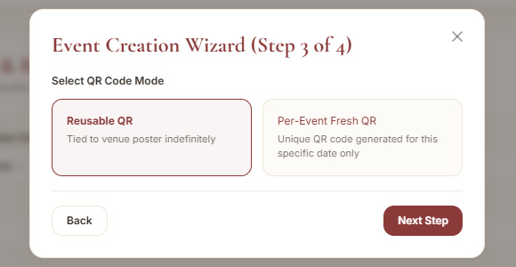 | **QR Code Mode**: Select between **Reusable QR** (tied indefinitely to venue poster) or **Per-Event Fresh QR** (unique to specific date). |
| **Step 4** | 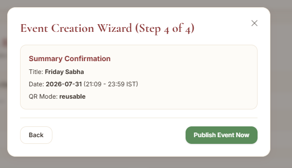 | **Summary Confirmation**: Final review of Title, Date, Time, and QR Mode before publishing live to the system. |

---

### 6. Mandir Venues & Leaflet Geofence Map

#### Venue Geofence Configuration & Google Maps Link Extractor
- **Description**: Panel showing saved Mandir venues list with edit/delete buttons, address description fields, geofence radius slider (10m - 500m range), and instant Google Maps URL link location extractor.
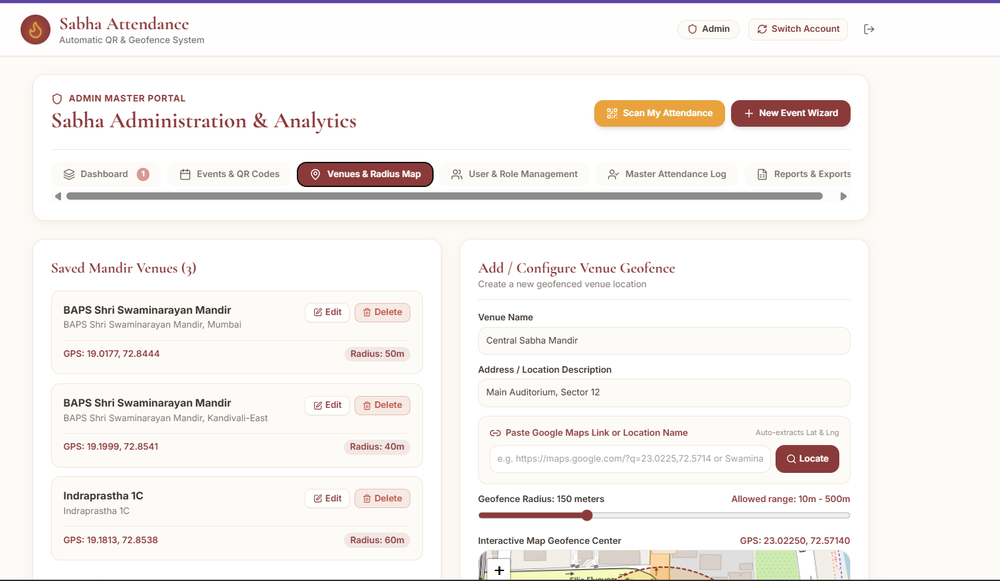

#### Leaflet Interactive Map Geofence Center
- **Description**: Interactive Leaflet map widget with draggable pin center, red dashed geofence radius circle overlay visualizer, and "Save Venue & Geofence Circle" action button.
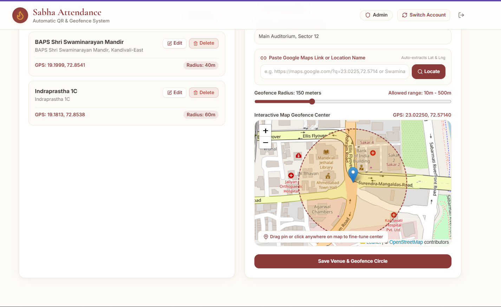

---

### 7. User & Role Management

#### Member Directory & Role Toggle Table
- **Description**: Manage all registered members with name/phone search bar, role filter dropdown (`All Roles`, `Admin`, `Karyakar`, `User`), streak/total count metrics, and instant role promotion/demotion buttons (**Promote to Karyakar** / **Demote to User**).
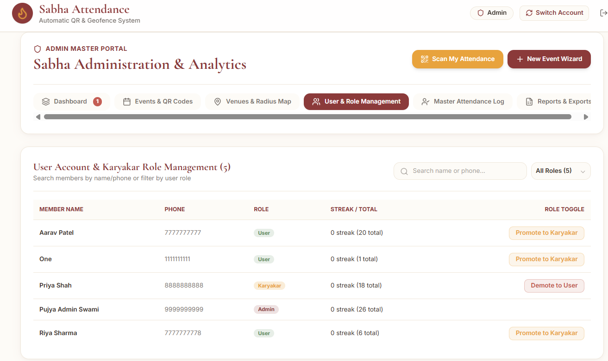

---

### 8. Master Attendance Log Analytics

#### Master Attendance Log — Event-Wise Grid View
- **Description**: Analytics layout displaying events with total headcount, present/absent stats, turnout ratio progress bars, direct PDF/Excel export buttons, and **View Full Event Logs & Audits** detail modal launcher.
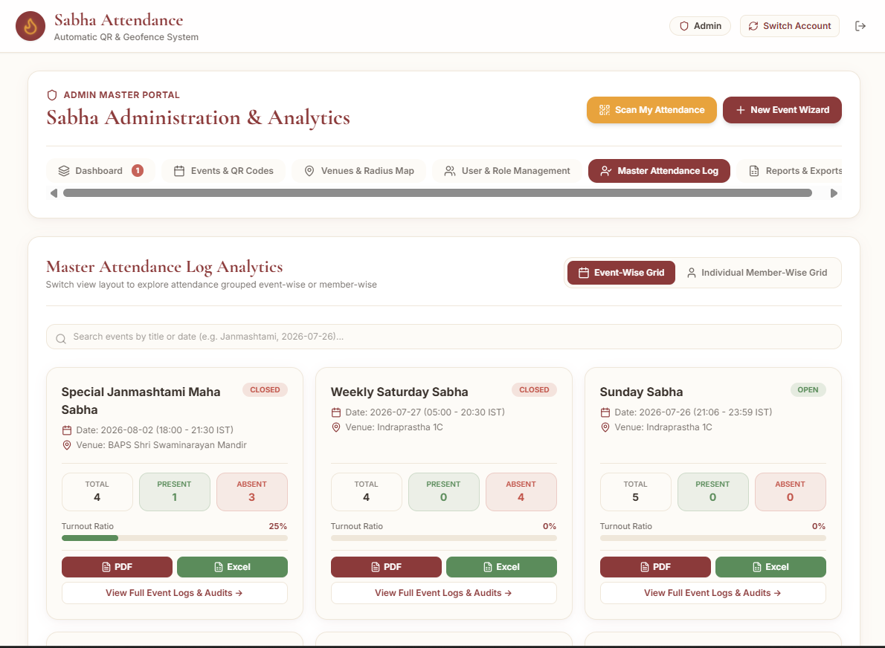

#### Master Attendance Log — Individual Member-Wise Grid View
- **Description**: Analytics layout displaying member cards with Total Attended, Present Count, Absent Count, Current Streak, and **View Member Attendance History** button.
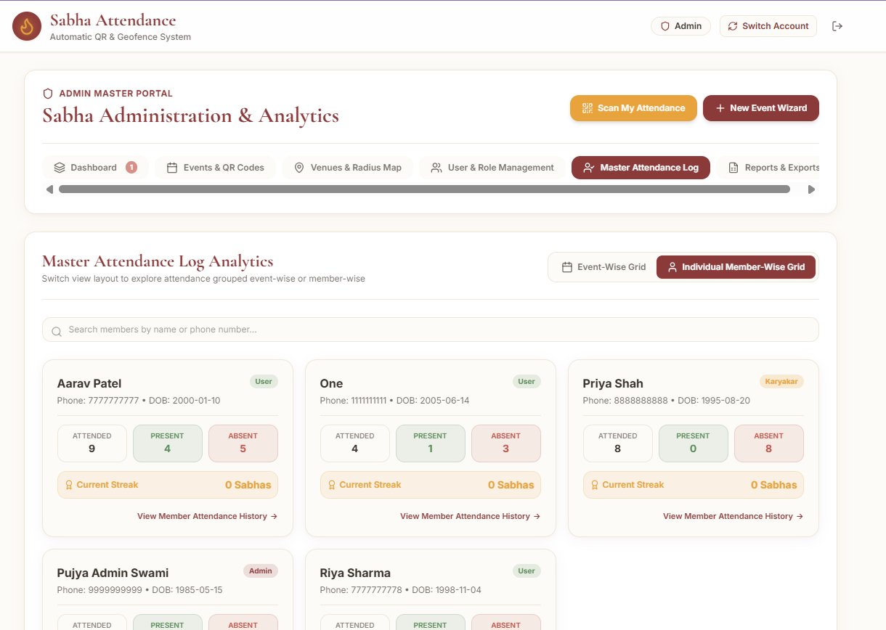

---

### 9. Attendance Data Exports & Reports

#### Custom Export Generator (Excel & PDF)
- **Description**: Generator supporting event-specific selection or custom date range filtering. Downloads event-grouped Excel spreadsheets (`.xlsx`) and printable PDF summary reports (`.pdf`) featuring event title, date, time, venue, and turnout stats at the top of every section.
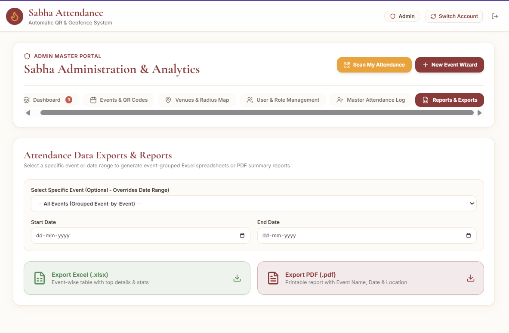

---

## 🛠️ Technology Stack

```
┌─────────────────────────────────────────────────────────────────┐
│                      FRONTEND (Vite + React)                    │
│  React 18 • Tailwind CSS • Lucide Icons • Leaflet • HTML5-QRCode │
└─────────────────────────────────────────────────────────────────┘
                                 │
                            HTTP / REST
                                 ▼
┌─────────────────────────────────────────────────────────────────┐
│                      BACKEND (FastAPI + Python)                 │
│  FastAPI 0.115 • SQLAlchemy ORM • PyJWT • OpenPyXL • ReportLab  │
└─────────────────────────────────────────────────────────────────┘
                                 │
                                 ▼
┌─────────────────────────────────────────────────────────────────┐
│                     DATABASE (SQLite / PostgreSQL)              │
│       Users • Venues • Events • Attendance • AuditLogs          │
└─────────────────────────────────────────────────────────────────┘
```

---

## 🗄️ Database Architecture

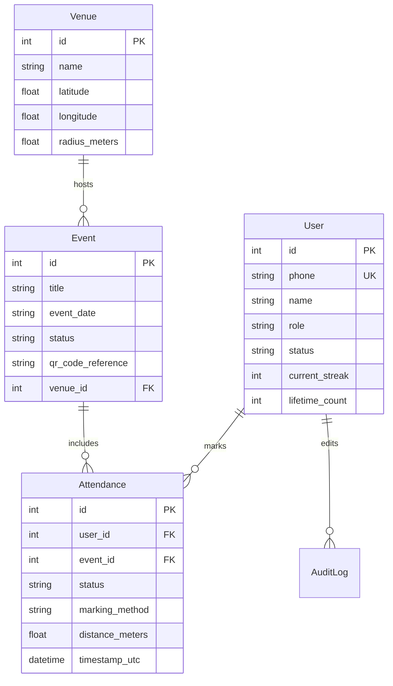
```mermaid
erDiagram
    User ||--o{ Attendance : "marks"
    Event ||--o{ Attendance : "includes"
    Venue ||--o{ Event : "hosts"
    User ||--o{ AuditLog : "edits"

    User {
        int id PK
        string phone UK
        string name
        string role
        string status
        int current_streak
        int lifetime_count
    }

    Venue {
        int id PK
        string name
        float latitude
        float longitude
        float radius_meters
    }

    Event {
        int id PK
        string title
        string event_date
        string status
        string qr_code_reference
        int venue_id FK
    }

    Attendance {
        int id PK
        int user_id FK
        int event_id FK
        string status
        string marking_method
        float distance_meters
        datetime timestamp_utc
    }
```

---

## 🚀 Installation & Quick Start Guide

### Prerequisites
- **Node.js**: v18.0 or higher
- **Python**: v3.10 or higher

### 1. Clone & Setup Project
```bash
git clone https://github.com/omkarpraval/Sabha_Attendance.git
cd Sabha_Attendance
```

### 2. Install Backend Dependencies
```bash
cd backend
pip install -r requirements.txt
```

### 3. Install Frontend Dependencies
```bash
cd ../frontend
npm install
```

### 4. Run Application (Single Command)
Execute the single runner script to start both FastAPI Backend (`http://127.0.0.1:8000`) and Vite Frontend (`http://localhost:5173`):
```bash
cd ..
python run.py
```

---

## 🔑 Demo Login Accounts

| Role | Mobile Phone | Password | Access Level |
| :--- | :--- | :--- | :--- |
| **Admin** | `9999999999` | `admin123` | Full Access, Event Creation, Venue Map, Role Mgmt, Reports |
| **Karyakar** | `8888888888` | `karyakar123` | Event View, Manual Attendance Marking, Export Reports |
| **User / Member** | `7777777777` | `user123` | Self Attendance Scan, Diya Streak Tracker, Excuse Submission |

---

## 📄 License
Distributed under the MIT License. See `LICENSE` for details.
